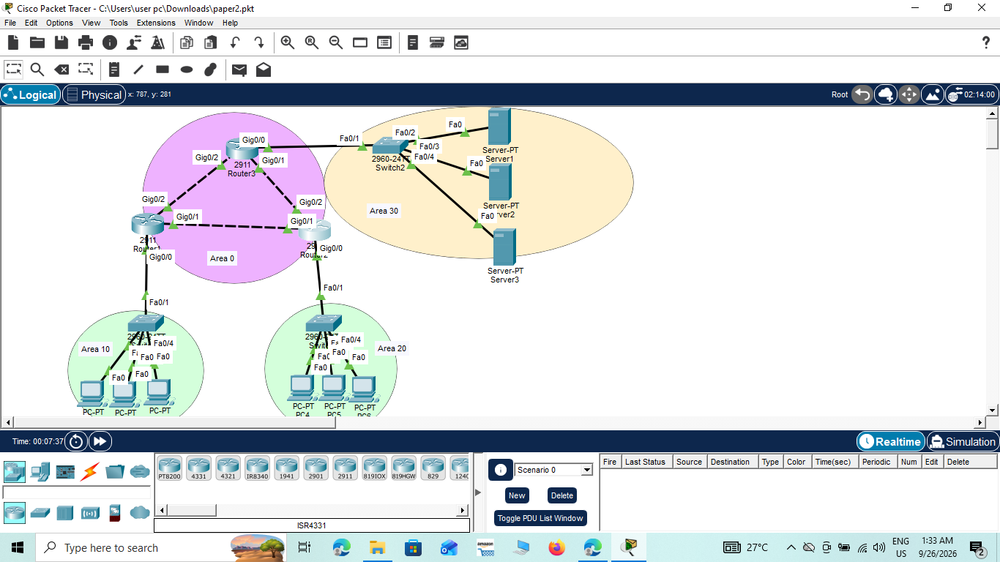

# Multi-Area OSPF Network Design — Cisco Packet Tracer

## Overview
This project simulates a multi-area OSPF network built in Cisco Packet Tracer as part of my
practical networking coursework. The design includes 3 routers connected across 4 OSPF areas
(Area 0 backbone, Area 10, Area 20, and Area 30), department switches, end-user PCs, and
dedicated servers — modeling a small enterprise network with segmented departments and a
services area.

## Topology Diagram


- **Area 0 (Backbone):** Router1, Router3, Router4 form the OSPF backbone.
- **Area 10:** Switch + 3 PCs (department network).
- **Area 20:** Switch + 3 PCs (department network).
- **Area 30:** Switch + 3 servers (Server1, Server2, Server3).

## Devices Used
| Device       | Quantity | Role                                  |
|--------------|----------|----------------------------------------|
| Router 2911  | 3        | OSPF routing, inter-area connectivity  |
| Switch 2960  | 3        | Access-layer connectivity              |
| Server-PT    | 3        | Hosted services in Area 30             |
| PC-PT        | 6        | End-user devices in Areas 10 and 20    |

## Configuration Highlights
- Configured OSPF process on all routers with `router ospf 1`.
- Assigned each router interface to its correct OSPF area using `network <ip> <wildcard> area <id>`.
- Set unique router IDs for each router using `router-id`.
- Verified neighbor formation and route exchange between all areas.

Example configuration snippet (Router1):
```
router ospf 1
 router-id 1.1.1.1
 network 10.0.0.0 0.0.0.255 area 0
 network 10.0.1.0 0.0.0.255 area 10
```

## Verification
Commands used to confirm the network was working correctly:

- `show ip ospf neighbor` — confirms OSPF adjacencies formed between routers.


- `show ip route` — confirms routes learned from other areas via OSPF.


- `ping` between PCs and servers across areas — confirms end-to-end connectivity.


## Tools Used
- Cisco Packet Tracer

## Project File
The complete Packet Tracer file is available here: [`multi-area-ospf-network.pkt`](multi-area-ospf-network.pkt)

## Author
Nalaka Priyadarshana
BICT Undergraduate, University of Vavuniya
[LinkedIn](https://linkedin.com/in/nalakapriyadarshana) | [GitHub](https://github.com/Nalaka201)
